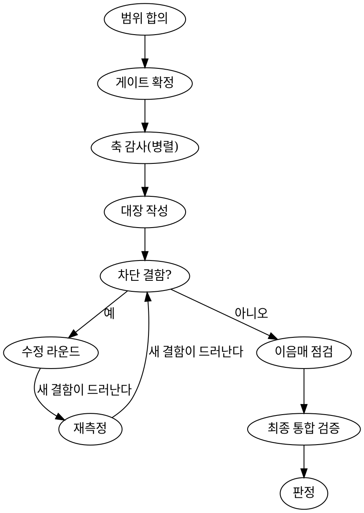

# Verifying Production Readiness

## Overview

**판정은 관측으로만 내린다.** 초록색 테스트·통과한 타입체크·"스테이징에서 잘 되더라"는 **출하 근거가 아니다.** 그것들은 *알려진 것*이 깨지지 않았음을 말할 뿐, *모르는 것*에 대해 아무 말도 하지 않는다.

이 스킬은 **판정 → 수정 → 재판정**을 여러 세션에 걸쳐 반복할 수 있는 구조를 만든다. 산출물은 의견이 아니라 **결함 대장(ledger)** 이고, 다음 세션은 대장의 열린 항목부터 이어받는다.

## The Iron Rules

**1. 게이트는 착수 전에 수치로 못 박는다.** 「테스트 통과」가 아니라 「<스위트> N pass / **fail 0** · 취약점 **프로덕션 도달 0** · 접근성 AA 미달 **≤ K**」처럼 **세는 방법과 임계값**까지. **결과를 보고 기준을 조정하면 그건 판정이 아니라 사후 승인이다.**

**2. 모든 지적에 `파일:줄` 또는 재현 명령을 붙인다.** 붙일 수 없으면 그건 발견이 아니라 인상이다. 인상은 「확인 필요」로 따로 적는다.
실측 결과가 **서술로만** 넘어온 경우(남이 재 준 값, 도구 출력 요약)는 **무엇을 · 어떤 도구·명령으로 · 언제** 확인했는지 세 요소를 적고 `measured` 를 유지하되, **`파일:줄` 보강을 다음 할 일로 남긴다.**

**3. 정적 감사만으로 판정하지 않는다.** 실제 사용자 시나리오를 **제품으로 끝까지 해 본다.** **실측 사례**: 정적 감사 축 전부가 놓친 출하 차단 결함을 E2E 시뮬레이션 하나가 잡았다 — 대용량 내보내기 한 번이 API 서버 전체를 수 분간 정지시켰다. 단위 테스트도 코드 리뷰도 이걸 못 본다.

**4. 고친 뒤 반드시 재측정한다.** **수정은 다음 결함을 드러낸다.** 한 한계를 걷어내면 그 뒤에 가려져 있던 다음 한계가 나온다(메모리 → 파일 포맷 → 타임아웃). 「고쳤다」는 주장이고 **재측정이 관측이다.**

**5. 측정 환경이 오염되면 수치는 전부 무효다.** 부하·공유 DB·죽은 프로세스가 낀 창은 **버린다.** 자세히는 `measurement-hygiene.md`.

**6. 「원래 실패해요」는 그 자체가 결함이다.** 상시 빨간 테스트 하나가 진짜 결함을 덮는다. 설명이 필요한 빨간 테스트가 0이 될 때까지 판정하지 않는다.

**7. 감사도 틀린다.** 근거를 든 반박은 채택한다. 이미 고쳐진 것을 결함으로 올리는 일(stale)이 실제로 있었다. 반박·기각도 대장에 **사유와 함께** 남긴다.

## 계획 모드 vs 실행 모드

**대상 시스템에 아직 접근할 수 없는 상태**(계획만 세우는 단계, 코드베이스 없음, 실데이터 규모 미상)에서도 이 스킬을 쓴다. 그때는 두 가지를 지킨다.

- **게이트를 가정치로 적고 `⚠가정` 을 붙인다.** 착수 첫 작업은 그 가정치를 **실측 기준선으로 교체**하는 것이다.
- **Iron Rule 1 은 「기준선을 나중에 재는 것」을 금지하지 않는다.** 금지하는 것은 **결과를 본 뒤 임계값을 낮추는 것**이다. 기준선 측정과 임계값 완화를 혼동하지 마라. 임계값을 바꿔야겠다면 **바꾼 사실·시각·사유를 리포트에 남긴다.**

## 컨텍스트 비용

`SKILL.md` 는 이 파일 하나로 판정을 시작할 수 있게 짧게 유지한다. 참조 문서는 **필요할 때만**
연다 — `axes.md` 는 **보는 축의 절만**, `report-template.md`·`media-adapters.md` 는 그 형식이
실제로 필요해질 때. 전량 로드는 대상 코드를 보기도 전에 창의 10% 이상을 쓴다.

## 경량 모드 — 소규모·1세션이면 이걸 쓴다

전체 기계(11축 병렬·축별 파일)는 **정식 출시·다세션**용이다. 소규모 변경·1세션 검토에 그대로
쓰면 의식 비용이 산출을 넘는다. 그때는:

- **축**: 코어 4축 ④⑥⑧⑨ + **변경이 닿는 축**만. 뺀 축은 뺐다고 적는다.
- **파일**: `readiness.md` **하나**(대장 형식은 정식과 동일 — `ledger-lint.sh readiness.md` 로 그대로 검사된다).
- **유지되는 것**: Iron Rule 1(게이트 선확정)·2(파일:줄)·4(재측정), 근거 등급, lint.
  **GO 는 여전히 measured 없이는 못 낸다** — 실측이 불가능하면 조건부(조건 명시) 또는 판정 불가로.
- 리포트 첫 줄에 「경량 모드」라고 적는다.

**웹이 아닌 대상**(네이티브·CLI·라이브러리·파이프라인·데몬)은 축을 빼지 말고 `media-adapters.md`
의 번역표로 재해석한다.

## 착수 첫 단계 — 범위 합의 (사용자 선택 게이트)

**축 감사 전에 어떤 축을 볼지 사용자와 합의한다.** 결과를 보기 **전**이므로 Iron Rule 1 위반이
아니다 — 금지되는 건 결과를 본 뒤의 사후 축소다.

대화형이면 착수 첫 행동으로 묻는다(AskUserQuestion): **모드**(경량 = 코어 4축 + 닿는 축 ·
정식 11축 · 커스텀) — 커스텀이면 아래 「뺄 수 있는 축」에서만 고르게 한다.
비대화형(크론·헤드리스)이면 `axes.md` 「축 선택」의 상황별 최소 축을 쓰고 **무엇을 기본
적용했는지 리포트에 적는다.** 물을 수 있는데 안 묻고 임의로 좁히지 마라.

**고른 결과는 손으로 적지 말고 뼈대에 박는다** — 합의가 산문으로만 남으면 다음 세션이
무엇을 안 봤는지 추측하게 된다:

```bash
bin/vpr new <대상> --axes 3,5,7        # 코어 ④⑥⑧⑨ 는 자동 포함 — 못 뺀다
```

그러면 리포트 머리에 `축: … · 뺀 축: … — <사유>` 선언과 「보지 않은 것 → 가. 의도적 제외」가
생기고, 정식 모드는 **고른 축의 파일만** 만든다(안 볼 축의 빈 파일은 「봤는데 비어 있다」로
읽힌다). lint 는 그 선언의 정합성을 본다 — **R13**.

**코어 축 — 사용자도 뺄 수 없다**: ④ 사용성·E2E(정적 감사 전부가 놓친 차단 결함을 이 축이
잡은 실측 사례) · ⑥ 보안(유출은 되돌릴 수 없다) · ⑧ 논리·데이터 정합성 · ⑨ 결정성(플레이키는
다른 축의 measured 를 통째로 무효화한다). **변경이 닿는 축도 코어처럼 다룬다.**

**뺄 수 있는 축**: ①기능 ②백엔드 ③UI·접근성 ⑤성능 ⑦공급망 ⑩배포 ⑪관측성.

**뺀 축은 리포트 「보지 않은 것 → 가. 의도적 제외」에 누가·왜 적는다.** 안 적으면 「봤는데
괜찮았다」로 읽힌다. 그리고 **판정문에 커버리지 한계를 명시한다** — 「출하 가능」은 본 축에
한한 판정이고 안 본 축에는 아무 말도 하지 않는다.

## 근거 등급 — 이게 없으면 판정이 아니다

대장의 모든 행에 등급을 붙인다. `claimed`(사람의 진술만) · `code`(코드·설정을 읽어 확인) ·
`measured`(**실제로 돌려서 관측**).

- **경계**: 「없다」는 `code` 로 확정된다(실행해 볼 대상이 없다). **「있고 동작한다」는 반드시
  `measured`** — 롤백 버튼이 있다는 말은 눌러 보기 전까지 관측이 아니다.
- **심각도는 올릴 수만 있다.** 낮추는 건 수정이 아니다. `claimed` 행의 심각도는 「진술이 틀렸을
  때 무엇이 깨지는가」로 매기고 `(후보)` 를 붙인다 — 실측 후엔 **등급을 올리지 심각도를 낮추지 않는다.**
- **`measured` 아닌 근거만으로 「출하 가능」을 낼 수 없다.** 진술·코드 독해는 NO-GO 나 「확인
  필요」는 낼 수 있어도 통과는 못 낸다.

**이 규칙은 자기보고로 지켜지지 않는다 — 기계로 검사한다.** 판정 전과 재진입 직후에 반드시:

```bash
bin/vpr lint <리포트 디렉터리 | readiness.md>   # R1–R13, 위반 시 exit 1 (--strict 로 증거 범위 제한)
```

**lint 를 통과하지 못한 대장으로 낸 판정은 무효다.** 규칙 전문은 `README.md` 「규칙 요약」 —
핵심만: **R8** 통과 판정은 실측 근거 필수 · **R9** 게이트 실측칸은 수치나 인용 · **R10** 게이트 표
없이 통과 없음 · **R11** 조건부는 조건 명시 필수 · **R12** 형제 파일(요약)의 판정이
대장과 갈리면 위반 · **R13** 코어 축은 「뺀 축」에 못 넣고, 통과 판정이면 뺀 축에 사유 필수. 인용 경로는 ①리포트 디렉터리 ②저장소 루트
③절대경로 순으로만 찾는다(CWD 무관 — 어디서 돌려도 같은 판정).

단, lint 는 인용의 **존재·줄 범위·비어 있지 않음**까지만 본다. 내용이 진짜 근거인지는 재진입
세션이 의심하는 몫이다(`report-template.md` 재진입 절차).

## Workflow



**Phase 0 — 범위 합의 + 도구 확보.** 위 「착수 첫 단계」대로 축을 합의한 뒤:
```bash
bash bin/ensure-tools.sh --install   # CLI 는 brew, 스킬은 **이미 등록된** 마켓플레이스에서만
```
설치가 안 되는 것은 해당 축 파일에 「위임 불가 — 직접 수행」이라 적고 `axes.md` 의 「어떻게」대로
직접 감사한다. **도구가 없다는 이유로 축을 빼지 마라.**

**Phase 1 — 축 감사.** 합의된 축을 **병렬**로(축별 독립 에이전트가 이상적). **축마다 모델
등급을 정해 dispatch 한다** — 오케스트레이터와 ④⑥⑧ 은 **설계·판단** 등급, 도구 결과를 규격대로
회수하는 축은 **실행·회수**, 형식 정리는 **기계적** 등급(`axes.md` 「축 ↔ 모델 등급」).
lint 는 형식만 보므로 **발견의 깊이는 전적으로 모델이 정한다** — 비용을 줄일 땐 ④⑧ 말고
실행·회수 축부터 내려라. 방법·판정선은
`axes.md`, 각 축은 자기 파일에 **감사 모델·위임 도구**와 함께 발견을 심각도·근거로 적는다. **세션에서 물리적으로 못 하는
것은 시늉하지 마라** — 경쟁 제품 체험판, 깨끗한 장비 설치 같은 것은 「나. 확인 불가」에 「누가
무엇을 주면 볼 수 있는지」와 함께 넘긴다. **시늉 감사는 미감사보다 나쁘다**(다음 사람이 「봤는데
괜찮았다」로 읽는다).

**Phase 2 — 수정 라운드.** 차단 결함부터, 라운드마다 파일 하나(`fixes-roundN.md`). 근본 원인
수정(증상 은폐 금지) · 건별 회귀 테스트 · **수정 후 실측** · 대장 상태 갱신.

**Phase 3 — 최종 통합 검증.** 전 게이트를 **경합 없는 창에서 한 번에** 재확인(여기서 처음 재는
게 아니다). 그리고 **이음매 점검** — 라운드끼리 어긋났는지(같은 값을 두 곳이 다르게 쓰는지,
표시와 강제가 갈리는지).

## 판정 문법

세 가지만 쓴다. **조건을 붙일 거면 조건도 관측 가능해야 한다.**

| 판정 | 뜻 |
|---|---|
| **출하 가능** | 차단 결함 0 · 전 게이트 초록 · 잔여는 전부 출하 후 백로그 |
| **조건부 출하 가능** | 차단 결함 0 · **명시된 조건 N건**을 출하 전에 충족해야 함(누가·무엇을·어떻게 확인) |
| **출하 불가(NO-GO)** | 차단 결함 ≥ 1. 무엇이 차단인지 ID 로 지목 |
| **판정 불가 — 근거 부재** | **결함을 찾아서가 아니라 확인할 수단이 없어서** 판정을 못 낸다. 감사 미착수 · 접근 불가 · 근거가 전부 `claimed` |

영문 리포트는 **GO / CONDITIONAL GO / NO-GO / UNVERIFIABLE** 로 적는다 — lint 는 이
고정 어휘만 인식하고, 그 밖의 판정 문구는 위반으로 처리한다.

**「출하 불가」와 「판정 불가」를 섞지 마라.** 출시를 막는 결론은 같지만 진술이 다르다 — 전자는 「이걸 고쳐라」이고 후자는 **「나에게 볼 것을 달라」**다. 후속 세션이 대장을 읽을 때 이 둘을 구분하지 못하면, 근거 부재를 결함으로 착각해 존재하지도 않는 버그를 찾는다. 판정 불가일 때는 **무엇이 있어야 판정할 수 있는지**를 함께 적는다.

## 리포트 구조 (다음 세션이 이어받는 근거)

골격·대장 포맷·재진입 절차는 `report-template.md`. 핵심은 **결함 대장**이다 — 안정적 ID
(`SEC-03`) · 상태(`open/fixing/fixed/verified/rejected/deferred`) · 근거 등급 · **닫은 증거**.
요약 문장이 아니라 대장이 정본이고, 다음 세션은 판정과 `open` 항목만 읽고 이어간다.

새 리포트는 손으로 만들지 말고 **뼈대를 생성**해라(형식이 틀리면 lint 가 거부한다):

```bash
bin/vpr new <대상 경로> [--full] [--axes 3,5,7]   # 경량 readiness.md 또는 정식 디렉터리
```

**판정·라운드가 갱신될 때마다 HTML 아티팩트로 게시한다** — 리포트 파일은 로컬이라 원격
사용자가 못 본다. 렌더는 스크립트, 게시는 세션이 Artifact 도구로:

```bash
bin/vpr render <리포트 디렉터리 | readiness.md>   # → report.html
```

갱신은 **같은 경로로 재게시**해 URL 을 유지한다. `report-html.py` 는 렌더 전에 lint 를 돌려
**위반 대장의 렌더를 거부한다**(판정 무효인 리포트를 공유하는 것이 되므로).

## Rationalization Table

| 변명 | 현실 |
|---|---|
| 「테스트 다 통과했으니 됐다」 | 테스트는 **네가 상상한 실패**만 검사한다. 부하·복구·권한·동시성은 대개 상상 밖이다 |
| 「스테이징에서 잘 되던데」 | 스테이징은 데이터·부하·기간이 다르다. **한 번 해 봤다 = 재현 가능이 아니다** |
| 「그 취약점은 devDependency 라 상관없다」 | **프로덕션 도달 여부를 실제로 추적**해서 말하라. 「아마 안 갈 것」은 근거가 아니다 |
| 「시간이 없으니 나중에」 | 시간이 없다는 건 **범위를 줄일 이유**지 판정 기준을 낮출 이유가 아니다. 조건부 출하로 조건을 명시하라 |
| 「이미 공지가 나갔다」 | 되돌리기 비용은 **결함의 존재 여부를 바꾸지 않는다.** 판정과 출시 결정은 다른 사람의 몫이다 |
| 「그 테스트는 원래 실패해요」 | 규칙 6 위반. 그 하나가 진짜 결함을 덮는다 |
| 「고쳤으니 됐다」 | 규칙 4 위반. 재측정 전까지 고쳐진 게 아니다 |
| 「일단 올리고 모니터링하면서 보자」 | **모니터링이 설정돼 있을 때만** 성립하는 말이다. 관측성 축을 먼저 보라 |
| 「축은 상황 봐서 정하죠」 | **베이스라인 실측: 매번 축이 달라져 다음 세션이 이어받지 못했다.** 축 번호는 고정이다. 뺄 수는 있어도 **뺐다고 적어야** 한다 |
| 「리포트는 마지막에 정리해서 쓰죠」 | 대장은 **발견 즉시** 적는다. 몰아 쓰면 근거가 유실되고 ID 가 흔들린다 |

## Red Flags — 멈추고 다시

- 게이트 수치를 **결과를 본 뒤에** 정하고 있다
- 발견에 `파일:줄`이 없다
- 제품을 한 번도 **써 보지 않고** 판정문을 쓰고 있다
- 수정 후 재측정 없이 「해결됨」으로 표시했다
- 부하가 높거나 프로세스가 죽은 창에서 잰 수치를 쓰고 있다
- 「대부분」·「아마」·「~일 것」이 판정 근거에 들어갔다
- 차단 결함을 「출하 후 백로그」로 옮기고 있다 — **심각도를 낮추는 건 수정이 아니다**

## 베이스라인에서 실제로 빠졌던 축

스킬 없이 「출하 검증 계획을 세우라」고 시켰을 때 만들어진 계획(8축)에 **통째로 없던 것**:

**UI·접근성**(③) · **페르소나 기반 사용성**(④) · **논리 불변식**(⑧) · **결정성·플레이키**(⑨) · **공급망**(⑦) · **관측성·알림**(⑪) · **이력 비밀 스캔**(⑥).

빌드·테스트·마이그레이션·보안·성능·복원력은 자연히 나온다. **나오지 않는 쪽이 위 목록이다** — 축 목록을 즉석에서 만들지 말고 `axes.md` 를 쓰는 이유다.

## Reference

`axes.md` 11축 상세(무엇을·어떻게·판정선·흔한 착각) + 도구 매핑 · `report-template.md` 리포트
골격·대장 포맷·재진입 절차 · `measurement-hygiene.md` 수치를 무효로 만드는 것들 ·
`media-adapters.md` 비웹 대상 축 번역표 · `README.md` 규칙 전문(R1–R13)·한계·설치 ·
`bin/vpr` **단일 진입점**(`new`·`lint`·`render`·`package`·`test`·`rules`) — 하위 스크립트를
직접 불러도 된다 · 테스트 `bin/vpr test`
